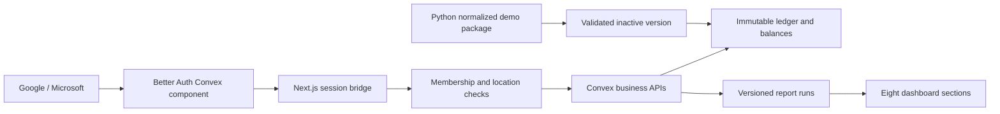

# Frontend and backend architecture

Two explicit modes share metric formulas. `demo` uses deterministic JSON and browser-local settings/additions; `convex` uses Better Auth and authorized report APIs. Authenticated builds remove the public fixture file, and fixture loading rejects authenticated mode.

| Path | Responsibility |
| --- | --- |
| `convex/schema.ts` | Typed tables, relationships and indexes |
| `convex/access.ts` | Identity, membership, capabilities and store grants |
| `convex/auth.ts`, `app/api/auth` | Official Better Auth integration; provider secrets remain in Convex |
| `convex/catalogue.ts`, `inventory.ts` | Scoped catalogue and paginated stock/history reads |
| `convex/operations.ts`, `domain/stock.ts` | Atomic receipt, sale, transfer, return, QC and bin movements |
| `convex/domain/idempotency.ts` | Payload fingerprint, stored result, audit and source watermark in one mutation |
| `convex/reports.ts`, `reportWorker.ts` | Authorized asynchronous snapshots, stable pages and readiness/staleness |
| `convex/settings.ts`, `exports.ts` | Versioned thresholds and permission-checked CSV continuations |
| `convex/imports.ts`, `domain/seed.ts` | Normalized staging, reconciliation and atomic dataset activation |
| `convex/http.ts`, `app/api/v1` | Bearer-token HTTP adapter and same-origin signed-in proxy |
| `lib/report-adapters.ts` | Shared report formulas and all fifteen business questions |
| `lib/providers/convex.ts` | Bounded authenticated frontend provider |
| `lib/provider.ts`, `lib/providers/fixture.ts` | Explicit local demo loading and report adapter |
| `components/convex-dashboard.tsx` | Authenticated reports, filters, charts, drawers, catalogue form and settings |
| `components/dashboard.tsx` | Original polished fixture dashboard |
| `components/workspace-gate.tsx`, `app/error.tsx` | Loading, signed-out, access-pending and error boundaries |
| `scripts/seed-convex.ts`, `import-convex.ts` | Explicit owner seed and authenticated administrator snapshot import |
| `netlify.toml`, `.github/workflows/check.yml` | Deployment build configuration and credential-independent checks |

Reports never send the raw ledger to the browser. Current workers read indexed pages into a server-side snapshot capped at 50,000 source rows; incremental `dailySales`/exposure pipelines are follow-up work. Runs bind organization, active version, data watermark, settings version and permission fingerprint. Changing any of these requires refresh; every page/export checks access again.

All operational mutations keep ledger/balance/financial/transfer changes in one transaction. Replaying a key with the same input returns its previous result; changing the payload conflicts. New operational dates advance the completed-day report cutoff. Imports create an invisible version, validate/reconcile it, and atomically switch the active pointer only if no intervening data write occurred. Existing grants remap by stable external location IDs.

Current APIs use opaque Convex document IDs, with external business IDs preserved in records and source transport. There is no running FastAPI/PostgreSQL service. Read [backend setup](backend-setup.md) for limits and [deployment runbook](deployment-runbook.md) for the live checks still required.

## Historical fixture architecture notes

## File map

| Path                            | Responsibility                                                                                                                            |
| ------------------------------- | ----------------------------------------------------------------------------------------------------------------------------------------- |
| app/layout.tsx                  | Root metadata and global styles                                                                                                           |
| app/page.tsx                    | Dashboard entry with Suspense boundary                                                                                                    |
| app/globals.css                 | Design tokens, component layout, responsive rules and focus/reduced-motion behavior                                                       |
| components/dashboard.tsx        | Eight sections, URL filters, report assembly, local settings, drawer state and export selection                                           |
| components/data-table.tsx       | TanStack sorting/pagination, scroll-contained table wrapper and accessible controls                                                       |
| components/charts.tsx           | Recharts visualization and accessible data-table alternative                                                                              |
| components/product-image.tsx    | Next Image display, stable dimensions and missing-source fallback                                                                         |
| components/ui/                  | Shared Button and Radix Dialog primitives                                                                                                 |
| lib/types.ts                    | Product, variant, ledger, sales, transfer, event, filter, settings and report interfaces                                                  |
| lib/provider.ts                 | Asynchronous fixture access seam                                                                                                          |
| lib/filter-options.ts           | Counts compatible catalogue/location choices from real report records; disables incompatible dropdown options                             |
| lib/analytics.ts                | Inventory reconstruction, filtering, recommendations, option health, trends, price bands, attributes, dupatta allocation and CSV escaping |
| scripts/generate_mock.py        | Canonical fixture generation and eleven logical input projections                                                                         |
| scripts/export_database_seed.py | Normalization, relational DDL and reconciliation                                                                                          |
| scripts/build_api_contract.py   | Proposed OpenAPI document generation                                                                                                      |
| tests/                          | Analytics, fixture integrity and backend-handoff contract checks                                                                          |
| docs/                           | Guides, assumptions, API/SQL drafts and screenshots                                                                                       |

The original repository used a Python-oriented ignore template, including `lib/`. That rule has been removed so the shared TypeScript provider, types, analytics and filter modules are included in Git. Always inspect the staged file list before pushing.

## State and interactions

Navigation chooses a section through `view` in URL parameters. Report filters merge with current parameters using native history updates, which Next's search-parameter hook observes. This avoids losing earlier filter changes during rapid consecutive edits. Browser navigation restores URL context. Table sort/page state remains local to its table.

Settings are browser-local for the prototype. Validation/reset and report recomputation use the shared defaults. Inventory rows are cached by Dataset identity; settings-dependent classifications are recomputed separately. Recommendations derive a shared allocation plan before display filtering, so changing pages cannot create additional donor stock.

Radix dialogs handle focus trapping and Escape. The dashboard remembers initiating elements, including a fallback when table cells remount, so focus restoration remains usable. On narrow screens a dialog replaces sidebar navigation; tables have their own horizontal scroll areas. Remote images preserve portrait presentation and a fallback. Reduced-motion rules suppress transitions; chart animation is disabled.

CSV converts the current primary report's complete filtered rows. Quoting and formula-prefix protection happen in shared analytics. Browser-generated exports are demo artifacts; a backend export must apply server-side authorization independently of the UI.

## Build and dependencies

The committed lockfile records the working package versions. Next.js/React/TypeScript, Tailwind, Lucide, Radix, TanStack Table, Recharts and CVA support the frontend. The interface uses both Tailwind setup and explicit global component CSS. Newsreader/Roboto are referenced in CSS; font/image loading can depend on network access, while fixture data is served locally.

`npm run build` uses Webpack because the development host restricted Turbopack worker binding. The repository includes optional Darwin ARM64 native packages for this host; npm skips incompatible optional packages on other platforms. Verify `npm ci` and the production build on the deployment platform before launch.

## Test boundaries

- TypeScript checks frontend model usage and component compilation.
- Vitest tests meaningful report invariants: no double allocation, price-source semantics, filters, stock exclusions and CSV handling.
- Python tests reconcile the source ledger and transfers, temporal stock validity and generated fixtures.
- Handoff tests import the normalized package into SQLite with constraints enabled, check tenant-scoped FKs, order consistency, hashes, forecasts, document links and OpenAPI references.
- A separate OpenAPI-spec-validator check validates the proposed document against OpenAPI 3.1.
- Browser screenshots and interaction review cover layout, titles, controls and representative drawers. They are not a certification of assistive technology support.

## Next-phase refactoring

The eight-view dashboard is a practical prototype module, not a final application architecture. Extract per-section modules and typed query hooks when introducing report APIs. Keep the shared table/chart/drawer presentation intact. In the original proposal, authoritative calculations, authorization, stock mutation and shared settings were to move to FastAPI; that proposal is superseded by the Convex implementation above. retain the fixture provider as a switchable demo/testing source. Add a query cache with authorized scope/settings/snapshot keys and a runtime response validator. Do not simply expose the entire ledger as a production substitute for the current `load()` method.
