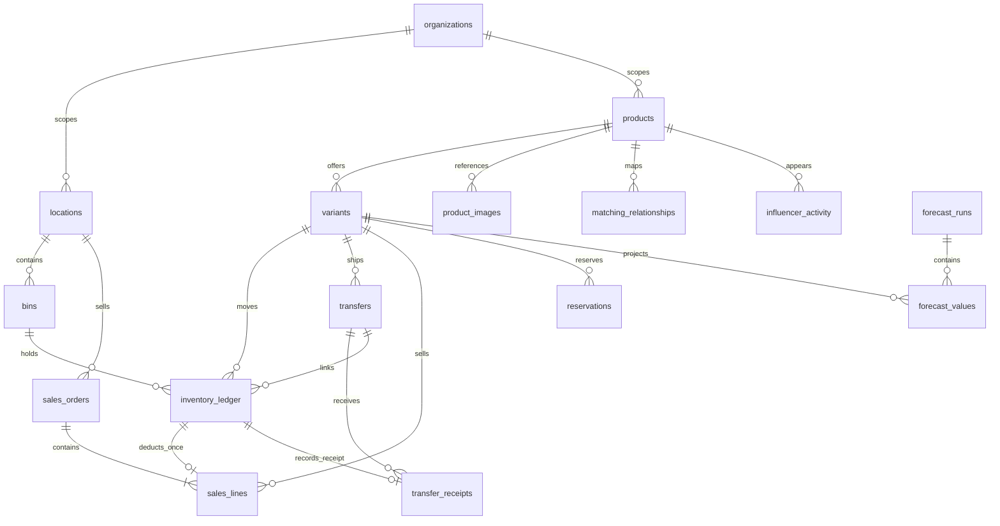

# Database design for the backend milestone

**Historical proposal, superseded on 8 October 2026.** The running source now uses Convex/TypeScript and Better Auth. The SQL/FastAPI/Supabase material below is retained for reference, not an additional deployed service. Use [backend setup](backend-setup.md), [runtime schema](../convex/schema.ts), [implemented API](api/convex-openapi.json) and [deployment runbook](deployment-runbook.md) for current work. The production follow-ups are scalable incremental report aggregates, live provider/deployment smoke tests, load tests, backups and restore drills.

## Original proposal

## Proposed foundation

Use standard PostgreSQL on Supabase, accessed through Python/FastAPI. Keep stock and sales tables in an unexposed `inventory` schema. The UI reads authorized API reports rather than downloading a company's full ledger. Supabase Auth may issue identity tokens; FastAPI must validate them and apply organization/location permissions before accessing data.

The relational core is provided as [portable SQL](database/relational-core.sql), [PostgreSQL draft](database/postgres-draft.sql) and [field contract](../data/normalized/table-contract.json). These are review artifacts, not production migrations. No Supabase project was created and no hosted database was modified. The portable schema is executed in SQLite tests; PostgreSQL execution is a next-phase acceptance gate.

All relationships between business tables include organization identity. This prevents valid-looking foreign keys from linking a sale in one organization to stock in another. A bin also has a composite FK check with its location. Core uniqueness includes product/variant SKU per organization, product-size combinations and sale movement identity. The draft uses a central owner ID; it models consignment without changing ownership, not multi-owner marketplace stock.

## Stock is a ledger

Physical balances are `SUM(quantity_delta)` grouped by organization, variant, location, bin and condition. Opening balances are ledger entries, not a second value added after a balance has already been derived. For source-backed production imports, an opening event needs a cutoff and an imported-through watermark to prevent overlapping movements.

A sale has one linked negative stock movement. Its financial record does not independently change stock. A return enters quarantine, followed by paired negative quarantine and positive sellable release after inspection. A bin move has paired negative and positive entries. A consignment transfer deducts its source on dispatch, keeps outstanding quantity in transit, and adds the destination only for confirmed receipts. Loss/damage/cancellation must be explicit resolution events, not silent changes to dispatched quantity.

The prototype's ledger is date-based and includes correction/returnable labels. Production needs event groups, recorded timestamps, immutable source IDs, actor, reason codes, transfer status and counterparties. Paired movements must be inserted atomically. Corrections should reverse and replace prior entries, preserving the audit trail.

## Constraints and transaction rules

Database constraints enforce scoped identities, valid enums, non-negative financial values, positive sales/receipt quantities and valid bin/location links. Some rules span rows and require transactional service logic or database functions:

1. Lock the relevant stock pool before a reservation or dispatch; reject insufficient available stock.
2. Lock the transfer line before receipt; total received must not exceed dispatched. Create receipt and destination movement in the same transaction.
3. Create a sale and its stock deduction atomically, protected by source event and idempotency uniqueness.
4. Use an immutable opening/correction sequence and validate chronological non-negative stock. Allow an authorized discrepancy workflow rather than deleting history to hide a bad balance.
5. Acquire locks in a stable variant/location order to reduce deadlocks; bounded retries must reuse the same idempotency key.
6. Recommendation generation shares source pools across the whole plan. Applying recommendations later must re-check and reserve live stock; a suggestion is not a reservation.

## Read models and indexing

Initial indexes support ledger variant/location/date, sales location/date, sales variant, and transfer destination/ETA queries. Start with ledger aggregation and shared SQL report definitions. Add maintained balance tables and daily snapshots when profiling justifies them; they are derived caches with reconciliation jobs, never a competing source of truth.

Store/date/product and attribute indexes depend on measured workloads. Avoid prematurely materializing each dashboard widget. A report should calculate its rows and totals from the same authorized filtered scope and snapshot watermark. Cache keys must include org, permitted locations, applied filters, settings version and snapshot/run ID.

## Access design

The draft enables RLS with no application policies/grants and revokes PUBLIC access. It is intentionally closed until the next milestone defines tested roles. Owners and privileged roles can bypass RLS; enabling it alone does not secure a backend connection. Use a dedicated least-privilege runtime role, trusted verified identity context and tested organization/location policies. Keep migration credentials separate. Never put Supabase secret/service-role credentials in browser code.

Suggested roles: viewer reads assigned locations; merchandiser reads network reports and requests transfers; inventory operator records approved receipts/QC for assigned locations; administrator manages memberships and settings. A store operator cannot read another store merely by changing a URL. Authorization belongs in both the API service and DB access model. Do not trust user-editable metadata for roles, or assume a generic authenticated policy is row ownership. Supabase's [RLS guide](https://supabase.com/docs/guides/database/postgres/row-level-security) explains policy behavior and privileged-role limits.

## Required production additions

| Addition                                                   | Why it precedes live operations                            |
| ---------------------------------------------------------- | ---------------------------------------------------------- |
| organization memberships and location grants               | Authorized data scope, server-managed roles                |
| import batches, source systems and external event keys     | Deduplication, traceability and reject reports             |
| movement event groups, actors and timestamps               | Atomic paired movements and durable audit                  |
| order returns/refunds and tax/discount fields              | Net sales definition and financial reconciliation          |
| transfer headers/lines, state machine, receipt/loss events | Multi-SKU dispatch, partial receipt and exception handling |
| reservations with state/expiry/source                      | Prevent stale holds and overselling                        |
| store assortment and season masters                        | Real broken-option denominator and freshness season        |
| settings versions and forecast model/run metadata          | Explain and reproduce historical recommendations           |
| idempotency records and job/outbox tables                  | Safe retries and reliable asynchronous work                |

Move from the portable core to actual migrations only after these decisions are reviewed. Validate PostgreSQL DDL on a local/test project, implement policies and adversarial access tests, then generate tracked Supabase migrations. No proposed schema is presented as an already deployed enterprise backend.
