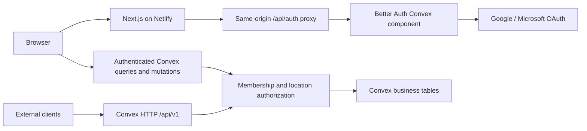

# Convex backend and Better Auth login design

Status: written design for review, 7 October 2026. Application code for this milestone has not been implemented or deployed.

## Intended outcome and decisions

Build a durable backend for the existing eight-screen inventory prototype, an accessible login page with Google/Microsoft sign-in, and version-controlled deployment configuration. Backend functions, inventory data and authentication records live in Convex; Next.js runs on Netlify. Push reviewable source and deployment instructions to the existing GitHub repository.

The user selected Better Auth with Google/Microsoft. This replaces the previous proposed FastAPI/Supabase architecture. Preserve the earlier normalized data definitions and stock-accounting rules as migration references; the old OpenAPI file is a design artifact, not an already-running API that must remain compatible. The new implementation must update documentation to distinguish implemented endpoints from future work.

Google/Microsoft social sign-in is the login scope. Company-managed SAML/OIDC enterprise connections are excluded: the current Convex Better Auth component lists its SSO plugin as incompatible. No password login, anonymous authentication, public administrator registration or automatic access based merely on an email domain.

The backend milestone covers all existing dashboard reads, catalogue creation/editing, versioned settings, validated data ingestion, and ledger-based stock writes. It does not add full warehouse-operation screens, live ecommerce/POS connectors, payment features or a trained forecasting model. A small Add product form may create a style and variants; receiving stock is a separate operation. Forecasts remain labelled precomputed demonstrations.

## Architecture

Use the official `@convex-dev/better-auth` component and Next.js proxy pattern, with the component-compatible Better Auth version pinned in the lockfile. Convex `_generated` types must come from the actual schema/code-generation tooling; do not hand-author a pretend generated API. Better Auth account/session tables are managed by the component, separate from inventory tables.

Use Convex queries for authorized reads and reactive updates, mutations for transactional changes, and actions only for I/O or batching. HTTP actions provide a documented REST surface for integrations and CSV exports and delegate to the same authorized domain functions. Browser callers primarily use the typed Convex client; no second inventory database or FastAPI service is necessary.

The existing `DataProvider.load(): Promise<Dataset>` is a prototype seam, not the production API. Extend it into a report provider with catalogue, product detail, report, export and settings methods. Refactor report data assembly out of the large dashboard component. Do not download 24 months of complete ledger history to a browser to render a metric. Retain the fixture provider for explicit local demo mode and report-parity tests.

## Login and authorization

The login page follows the established warm ivory, deep ink and bronze palette, with Newsreader headings and Roboto controls. Use a restrained card headed “Sign in to Inventory Studio,” Google/Microsoft buttons, and a short “Access is managed by your administrator” note. No promotional copy or unrelated fashion image. Include pending, failed sign-in, missing configuration, expired session and access-not-granted states. Keyboard focus, reduced motion and 375px layout are required.

Authentication succeeds through Better Auth's provider flow with state/callback checks and server-managed cookies. Use the official Convex auth bridge for backend tokens. Never treat a local-storage flag, email string or client-supplied role as authentication. Redirect destinations must be same-origin application paths; reject open redirects. Sign-out clears the session, cached authorized data and the selected organization.

Membership is separate from sign-in. A newly authenticated account without an active membership sees an access-pending screen and cannot fetch inventory. Membership is keyed by stable auth user ID and organization ID, not by a display name or unverified email. Every function resolves identity and membership server-side and checks every referenced entity belongs to the organization. Allowed locations apply to rows, totals, charts, product drawers and CSV exports.

| Role               | Capabilities                                                                                             |
| ------------------ | -------------------------------------------------------------------------------------------------------- |
| Viewer             | Read assigned locations; no costs unless explicitly granted                                              |
| Merchandiser       | Network reads and recommendations, catalogue maintenance; no stock dispatch without operation permission |
| Inventory operator | Authorized stock receipts, sale recording, transfers and QC at assigned locations                        |
| Administrator      | Membership/location grants, organization settings and permitted imports; audited operations              |

Capabilities are checked explicitly rather than assuming an ordinal role hierarchy. A transfer operator needs permission for both source and destination. Network recommendations require network access; a store viewer must not receive hidden donor stock, supplier costs or network totals.

First-administrator bootstrap is a deployment-owner/internal operation targeting an explicit auth user ID. No public “make me admin” endpoint and no privileged seed key in browser code. Subsequent changes require administrator permission and are audited. Disabled memberships take effect on subsequent backend requests even when the identity-provider session remains valid.

## Database model

Map the existing seventeen normalized tables into typed Convex documents. Retain external fixture/source IDs as `externalId` alongside Convex `_id`, with `(organizationId, externalId)` indexes. Convex IDs are used for document references. Each mutation enforces referenced organization/location identity; schema validators alone do not enforce foreign keys or unique business keys.

| Domain     | Tables and key fields                                                                                                                                                                                                                                                             |
| ---------- | --------------------------------------------------------------------------------------------------------------------------------------------------------------------------------------------------------------------------------------------------------------------------------- |
| Scope      | `organizations`: name, currency INR, timezone Asia/Kolkata; `memberships`: authUserId, organizationId, role, allowedLocationIds, active; `locations`: name, type, active; `bins`: locationId, name, excludedFromAvailability                                                      |
| Catalogue  | `products`: SKU, name, category, colour, fabric, craft, style, season, launchDate, costMinor, suggestedMrpMinor, provenance, archived; `variants`: productId, size, SKU, active; `productImages`: productId, URL/source URL, alt, dimensions, verification/provenance             |
| Inventory  | `inventoryLedger`: eventGroupId, variantId, locationId, binId, condition, quantityDelta, effectiveAt, recordedAt, reason, sourceId, actorId; `stockBalances`: derived physical/sellable/quarantine/reserved quantities and watermark                                              |
| Sales      | `salesOrders`: external/source identity, locationId, channel, businessDate; `salesLines`: orderId, variantId, quantity, transactionMrpMinor, netValueMinor or null, linkedMovementId, matchingStatus                                                                              |
| Transfers  | `transfers`: sourceId, destinationId, variantId, dispatched, received, ETA, ownership organization, status; `transferReceipts`: transferId, quantity, receiptDate, linkedMovementId, sourceId                                                                                     |
| Context    | `reservations`, `matchingRelationships`, `influencerActivity`, `events`, `forecastRuns`, `forecastValues`; preserve simulated flags and evidence/source metadata                                                                                                                  |
| Operations | `organizationSettings`: validated values and version; `idempotency`: operation/key/hash/result; `auditEvents`: actor, operation, entity, safe changes, request ID; `importBatches` and `importRows`: source hash, dataset type, validation/state, reject details, chunk progress  |
| Reporting  | `dailySales`: organization/location/variant/date units and price completeness; `stockExposure`: dated balance intervals; `reportRuns`: algorithm/settings/source watermark, readiness and expiry; `reportRows`: authorized report-run results for stable pagination and summaries |

Important indexes: membership by auth user + organization; business SKU/external IDs by organization; variant + location balances; ledger variant/location/effective date; sales location/date and variant/date; transfer destination/status/ETA; import source hash; idempotency organization/operation/key; report run/scope and stable result order. Uniqueness checks occur inside the mutation that inserts the record.

Dataset-owned business documents additionally carry `datasetVersionId`; organizations hold `activeDatasetVersionId`, and `datasetVersions` records capture staged/ready/failed state and source hashes. Membership and operational audit/idempotency are organization-scoped rather than silently copied between versions. Money is integer paise within JavaScript-safe range. Quantities are integers. Operational timestamps are UTC; trading dates use Asia/Kolkata. Immutable inventory events remain the source of truth. Cached balances and report aggregates are maintained transactionally where practical and reconciled to the ledger. Stock exposure intervals avoid storing a row for every possible variant/store/day.

## Transaction rules

1. Creating a new dress creates product, applicable variants and image references atomically. This does not create stock. Production/opening receipt is a separate authorized ledger operation. Reject duplicate SKU/size and invalid prices or attributes; archive instead of deleting referenced styles.
2. Each recorded sale creates one financial sales line and exactly one stock deduction in the same mutation. Imports referencing an existing deduction link to it after checking variant/location/quantity; they do not deduct again. Transaction selling prices never come from suggested MRP.
3. A dispatch checks current available source stock, creates the transfer/source deduction, updates derived balances and audit, and preserves central ownership. A receipt rejects nonpositive quantities and over-receipt and adds only received units to destination stock in the same mutation.
4. Returns enter quarantine. QC release creates paired quarantine-negative and sellable-positive events atomically. Bin moves have paired events. Dispatch center quantities remain retained but excluded from availability. Invalid cross-location bins and cross-organization references are rejected.
5. Writes require an organization-scoped idempotency key. Same key and canonical payload returns the original result; changed payload conflicts. Convex transactional conflict handling replaces the SQL row-lock plan; concurrent dispatches must read/update the same balance documents, with a test proving insufficient stock cannot be oversold.
6. Settings updates require an expected version and validate threshold order, supported required sizes and positive cover values. Report classifications/replenishment recalculate; forecasts never pretend to retrain.
7. A recommendation is not a reservation. Generation allocates one shared stock pool once; dispatch rechecks current availability and permissions. Keep enough stock at the sending store under the configured target days.

## API and report contract

Use typed validators and a shared domain layer behind Convex functions and HTTP actions. REST base is the deployment's `.convex.site/api/v1`; authenticated Next.js proxying can expose same-origin `/api/v1` if needed. Keep authentication routes separate from inventory routes.

| Resource  | Reads                                                                                                                                   | Writes in this milestone                                                          |
| --------- | --------------------------------------------------------------------------------------------------------------------------------------- | --------------------------------------------------------------------------------- |
| Identity  | `GET /me`, `GET /organizations`                                                                                                         | Admin membership changes, explicit location grants                                |
| Catalogue | `GET /locations`, `GET /products`, `GET /products/:id`                                                                                  | `POST /products`, versioned `PATCH /products/:id`, archive                        |
| Stock     | `GET /inventory`, bounded/paginated movement history                                                                                    | Receipts, sale recording, dispatch, partial receipt, quarantine return/QC release |
| Reports   | Overview, store sizes, rotation, sales/attributes, replenishment, HO shortages, slow stock, size quantities, forecasts, events, dupatta | Internal report-run creation; no stock write from a recommendation click          |
| Settings  | `GET /settings`                                                                                                                         | Versioned settings mutation                                                       |
| Imports   | Batch status and reject report                                                                                                          | Validate staged rows, then commit eligible batches                                |
| Export    | `GET /exports` by authorized report/run                                                                                                 | No arbitrary table dump                                                           |

Filters preserve the UI's location, channel, product/SKU, category, attributes, size and inclusive date semantics where applicable. Responses include `data`, report totals and `meta`: request ID, asOf, synthetic flag, currency/timezone, source watermark, settings/algorithm version, applied/ignored filters and pagination. Nullable evidence remains null. Calendar year remains independent of activity/sales dates; store/channel affect only event sales timelines. All fifteen business questions must still have visible answers.

Use cursor pagination with default 25/max 100 rows and stable tie-breaks. Old proposed page-number pagination is superseded explicitly in the new API document. Reject malformed dates, unknown fields, unsupported sorts and out-of-scope references. Standard errors distinguish unauthenticated, access denied, invalid input, not found, insufficient stock, duplicate/conflicting request and stale settings. HTTP adapters map them to 401/403/422/404/409 without disclosing internal details.

Large report preparation reads indexed source data in bounded batches and writes a versioned run. Publish rows and totals only when the run is ready and reconciled; do not mix partial batches or independently recompute donor pools per page. Queries return bounded results rather than calling unbounded `collect()` on the full ledger. Sales/history limits and report readiness are visible. Expired or stale runs require refresh; every page/export remains tied to one watermark. Re-check current membership and location permissions when serving a cached run; a revoked grant invalidates its authorized use. Network forecast/recommendation results require network permission and are never leaked through a store-only cache or export.

## Seed and input handling

Import the committed synthetic package: thirty products, 150 variants, 7,471 sales, 15,953 movements and 38,070 normalized rows. Remap references into Convex IDs in dependency order; use staged chunks capped at 100 rows plus a byte cap below current platform limits. Validate schema, hashes, source keys, money/quantity types and references before committing.

The eleven logical inputs remain supported. Opening inventory uses an explicit cutoff/import watermark. Import state is `staged → validated → committing → ready` or `failed`. Large imports are not falsely described as one transaction: prepare a new dataset version, keep it invisible until validation/reconciliation finishes, then atomically switch the active pointer. Per-chunk idempotency permits resume without duplicates. A failed dataset never replaces the previous ready dataset. Small operational writes remain immediately transactional against the active dataset.

Demo seed is an explicit administrator/deployment-owner command for development or isolated preview databases. Production seeding requires an explicit environment guard and synthetic label; startup and ordinary builds never silently clear or reseed a database.

## Frontend integration and deployment

Add `/login`, callback handling, protected workspace/access-pending boundaries and sign-out. Keep the established simple labels, HO – Central Warehouse naming, plain store names, missing-size language and section-scoped event controls. Add a minimal product-creation drawer with validation; creation and stock receipt stay separate. All existing eight reports, product drawers, settings and exports obtain authorized backend results in Convex mode.

Local demo mode works without cloud credentials and is clearly labelled. Missing credentials in hosted authenticated mode must fail closed with a setup message, never fall back to public fixture data or a fabricated session. Separate demo fixtures from authenticated production assets; a production build must not ship confidential future seed files in `public/`.

Version-controlled deployment deliverables are `netlify.toml`, `convex/convex.config.ts`, schema/auth configuration, `.env.example`, validation/build scripts and GitHub Actions checks. Use declarative platform configuration rather than adding Terraform to create unrelated infrastructure. Netlify's supported Next.js runtime hosts server routes; do not static-export the authentication proxy. Convex deploy + Next build follows the vendor's Netlify recipe with `NEXT_PUBLIC_CONVEX_URL` selected explicitly.

Separate development, preview and production deployments. Production pushes use a scoped production deploy key stored in Netlify secrets; pull-request previews use a distinct preview key and synthetic data. Never expose either under a `NEXT_PUBLIC_` variable. Convex stores `BETTER_AUTH_SECRET`, OAuth client secrets and trusted site origins. Netlify receives public deployment URLs/site URL plus its build deploy key. Google/Microsoft callback and origin configuration is documented for localhost and the deployed domain. OAuth configuration for arbitrary preview domains is not assumed to work automatically.

No account purchase, new cloud project, secret creation in a third-party dashboard or public production release is performed merely by writing source. Live deployment and real OAuth smoke testing need the user's configured accounts/credentials and chosen production domain. Implement and locally test all credential-independent work first; report external setup separately.

## Work packages and completion evidence

| Sequence | Deliverable                                                     | Evidence before completion                                                                                                                                             |
| -------- | --------------------------------------------------------------- | ---------------------------------------------------------------------------------------------------------------------------------------------------------------------- |
| 1        | Convex schema, validators, scoped identities, fixture remapping | FK/scope checks, seeded balances/revenue/transit parity, repeated seed harmless                                                                                        |
| 2        | Better Auth integration, login UI, access and roles             | Unauthenticated/disabled/outside-organization access denied; pending membership; logout; callback allowlist; mobile/keyboard UI review                                 |
| 3        | Catalogue/inventory APIs, dashboard provider and first reads    | Server results match fixture reports; bounded pagination; total/detail reconciliation; new product exists with zero stock                                              |
| 4        | Remaining six report groups, persistent settings, CSV           | All fifteen questions, price-source correctness, scoped export, fixed trend/date semantics, no duplicate recommendation allocation                                     |
| 5        | Ingestion and stock mutations                                   | Duplicate/concurrent sale/dispatch/receipt tests, over-receipt rejected, quarantine/dispatch excluded, stale settings conflict, import resume/failed-version isolation |
| 6        | Netlify/Convex configuration, CI and handoff                    | Production/demo mode checks, missing-config fail-closed, no secret commits, fresh-checkout build, backend unit tests, setup/runbook and GitHub push                    |

Use Vitest with `convex-test` for schema/domain/auth/transaction tests and report parity. Add two organizations and assigned-store identities to authorization tests. Real cloud concurrency, OAuth provider callbacks and Netlify runtime behavior must be smoke-tested in an isolated deployment after credentials are configured; mocked identity tests are not presented as proof of live SSO.

## Alternatives considered

- **Selected: Better Auth + Convex component.** Own authentication configuration and retain integrated database/session hosting; more maintenance responsibility than a managed identity provider.
- **Clerk + Convex.** Strong managed integration and a free tier suitable for social login; enterprise SSO and selected advanced features cost extra. User chose Better Auth instead.
- **Previous FastAPI + PostgreSQL/Supabase.** Useful relational reference model, but adding it beside Convex would duplicate backend responsibilities without a current requirement.

## Sources checked for this design

- [Convex + Better Auth Next.js integration](https://labs.convex.dev/better-auth/framework-guides/next): component registration, auth proxy/provider pattern, compatible version guidance.
- [Supported and incompatible Better Auth plugins](https://labs.convex.dev/better-auth/supported-plugins): enterprise SSO compatibility boundary.
- [Better Auth Google](https://better-auth.com/docs/authentication/google) and [Microsoft](https://better-auth.com/docs/authentication/microsoft): provider setup.
- [Convex schemas](https://docs.convex.dev/database/schemas), [atomicity/conflict handling](https://docs.convex.dev/database/advanced/occ), [HTTP actions](https://docs.convex.dev/functions/http-actions), [limits](https://docs.convex.dev/production/state/limits) and [convex-test](https://docs.convex.dev/testing/convex-test).
- [Convex deployment with Netlify](https://docs.convex.dev/production/hosting/netlify) and [Next.js on Netlify](https://docs.netlify.com/build/frameworks/framework-setup-guides/nextjs/overview/).
- [Clerk pricing](https://clerk.com/pricing): comparison checked 7 October 2026; not the selected provider.

## Review boundary

This is a concrete architecture and work-package breakdown for review. A task-by-task implementation plan follows approval of this written design. OAuth credentials, deployment IDs and domain values are configuration inputs, not invented placeholders to bake into code. Enterprise readiness still requires real-data validation, load testing, security review and restore drills beyond the prototype milestone.
